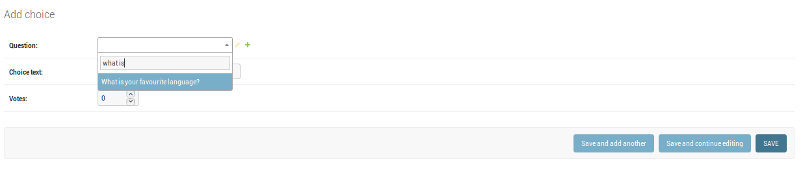

=====
Polls
=====

An implementation of the Polls App using Django 2.0

`pip install django==2.0`

Updated Features
----------------

1. Simplified URL routing syntax was implemented, using:
    `<int:id>` instead of `(?P<id>[0-9]{4})`
    
    Visit: https://docs.djangoproject.com/en/2.0/releases/2.0/#simplified-url-routing-syntax

2. Select2 implementation:
    

    The Select2 input looks similar to the default input but comes with a search feature that loads the options asynchronously. This is faster and more user-friendly if the related model has many instances.
    Visit: https://docs.djangoproject.com/en/2.0/ref/contrib/admin/#django.contrib.admin.ModelAdmin.autocomplete_fields

4. Mobile-friendly contrib.admin

Read the full Django2.0 Release Note here: https://docs.djangoproject.com/en/2.0/releases/2.0

# Some more Updates (WIP):
- on_delete is a required argument in Django 2.0. In older versions it defaults to CASCADE.
- `django.core.urlresolvers` module is removed in favor of its new location, `django.urls`.
